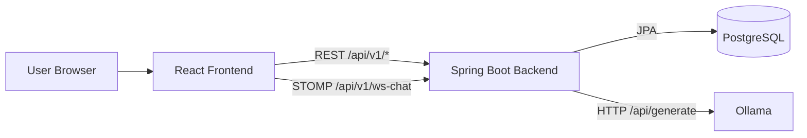
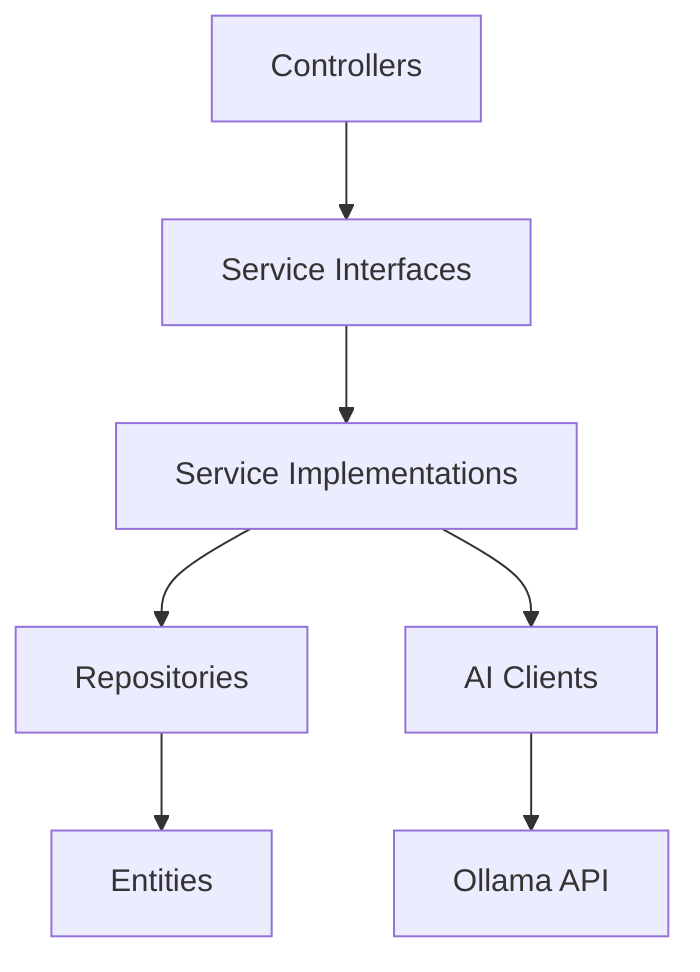
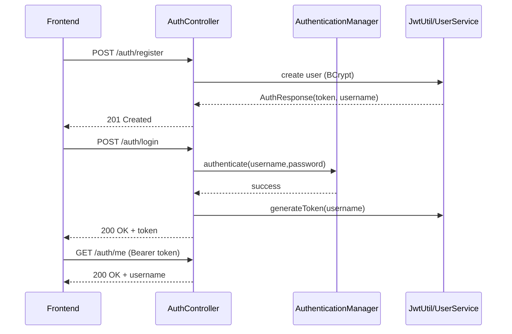
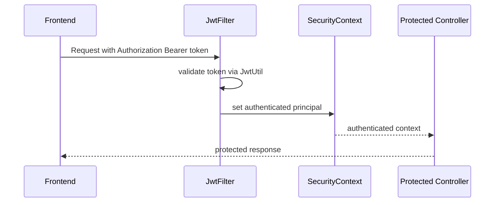
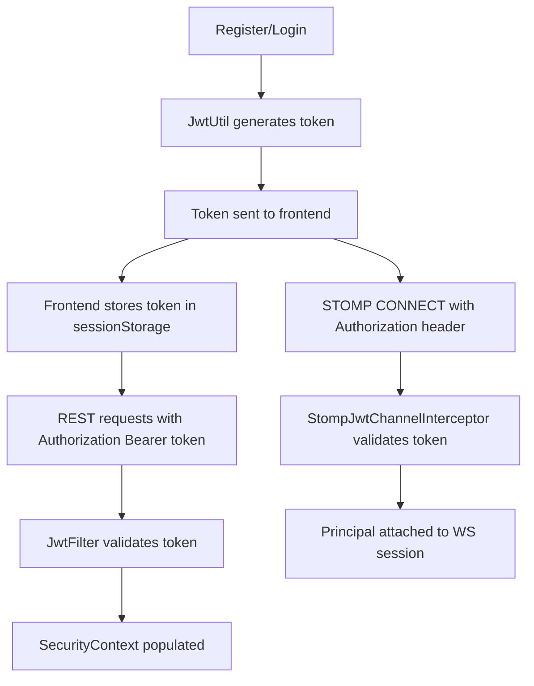
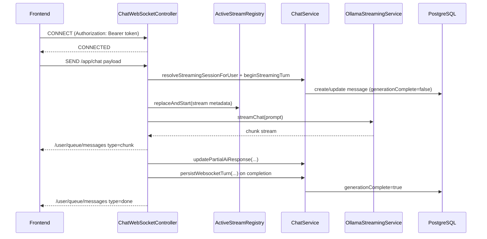
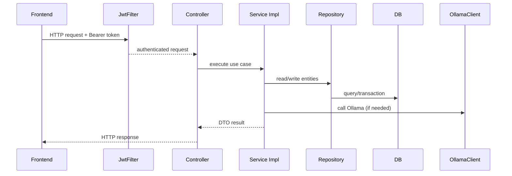
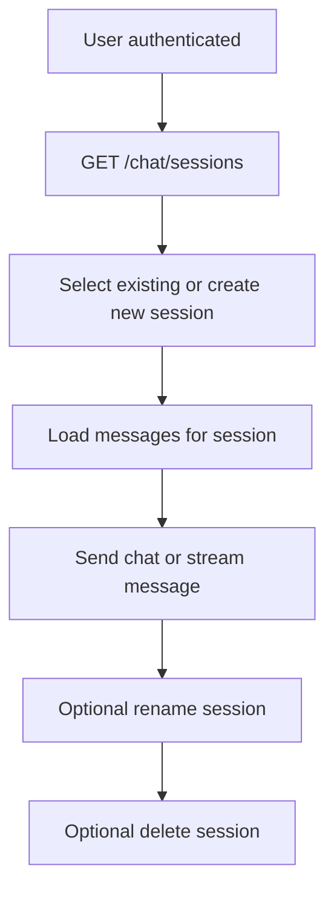
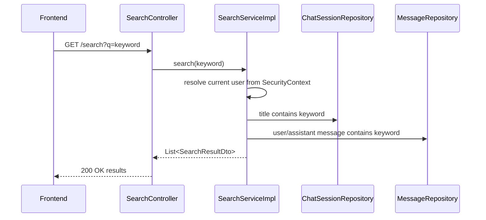
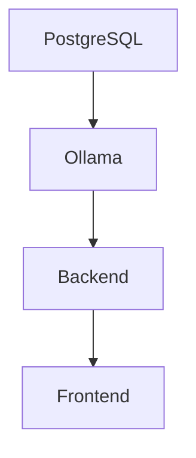

# Chatbot Platform

A full-stack chatbot platform with JWT authentication, chat session persistence, message history, search, and real-time AI streaming via WebSocket/STOMP.

---

## 1. Project Overview

This repository contains two applications:

- `backend`: Spring Boot API + STOMP WebSocket server + JPA persistence
- `frontend`: React + Vite web client

The platform provides authenticated conversation workflows with:

- Register/login
- Session-based chat history
- Search across conversations
- Streamed assistant responses
- Stream interruption/recovery support

---

## 2. Key Features

- JWT-based authentication (`register`, `login`, `me`)
- Stateless authorization for protected endpoints
- Chat session management:
  - create, list, rename, delete
- Message retrieval per session (with optional pagination)
- Search:
  - title matches
  - message content matches
- Real-time streaming chat:
  - STOMP publish/subscribe model
  - stop signal support
  - active-stream metadata endpoint for reconnect recovery
- Swagger/OpenAPI UI support

---

## 3. Technology Stack

| Layer              | Technology               | Version/Notes             |
| ------------------ | ------------------------ | ------------------------- |
| Backend Runtime    | Java                     | 17                        |
| Backend Framework  | Spring Boot              | 3.2.5                     |
| Web/API            | Spring MVC               | `spring-boot-starter-web` |
| Security           | Spring Security + JWT    | JJWT `0.12.3`             |
| Persistence        | Spring Data JPA          | PostgreSQL runtime        |
| Realtime           | Spring WebSocket + STOMP | Simple in-memory broker   |
| HTTP Client        | WebClient (WebFlux)      | Used for Ollama           |
| API Docs           | Springdoc OpenAPI        | `2.5.0`                   |
| Frontend Framework | React                    | `19.2.5`                  |
| Frontend Build     | Vite                     | `8.0.10`                  |
| Routing            | React Router             | `7.6.1`                   |
| Realtime Client    | `@stomp/stompjs`         | `7.3.0`                   |
| UI Icons           | `lucide-react`           | `1.14.0`                  |

---

## 4. Repository Structure

```text
chatbot/
├── backend/
│   ├── pom.xml
│   ├── Chatbot.postman_collection.json
│   ├── mvnw / mvnw.cmd
│   └── src/
│       ├── main/java/com/chatbot/
│       │   ├── client/        # Ollama sync client
│       │   ├── config/        # Security/CORS/OpenAPI/WebSocket/WebClient
│       │   ├── constant/      # Constants for paths/status/stream
│       │   ├── controller/    # REST + STOMP handlers
│       │   ├── dto/           # Request/response payloads
│       │   ├── exception/     # Global exception handling
│       │   ├── impl/          # Service implementations
│       │   ├── model/         # JPA entities
│       │   ├── repository/    # JpaRepository interfaces
│       │   ├── security/      # JWT filter/util/security chain
│       │   └── service/       # Interfaces + stream registry + prompt composer
│       ├── main/resources/
│       │   ├── application.yml
│       │   ├── application-prod.yml
│       │   └── application.properties
│       └── test/
└── frontend/
    ├── package.json
    └── src/
        ├── App.jsx
        ├── ChatApp.jsx
        ├── apiConfig.js
        ├── chatApi.js
        ├── websocket.js
        ├── context/
        ├── components/
        ├── hooks/
        └── pages/
```

---

## 5. High-Level Architecture

- Frontend calls backend over REST (`/api/v1/...`) for auth, session CRUD, messages, search.
- Frontend connects to backend STOMP endpoint (`/api/v1/ws-chat`) for streaming.
- Backend persists data in PostgreSQL (active profile config).
- Backend sends generation requests to Ollama (`/api/generate`) in sync and streaming modes.
- Stream state is tracked in backend memory (`ActiveStreamRegistry`) per user principal.

---

## 6. System Architecture Diagram (Mermaid)



### Layered Backend View



---

## 7. Backend Architecture

### 7.1 Package Responsibilities

| Package      | Responsibility                                                              |
| ------------ | --------------------------------------------------------------------------- |
| `controller` | REST and STOMP entry points                                                 |
| `service`    | Contracts + utility services (`ActiveStreamRegistry`, `ChatPromptComposer`) |
| `impl`       | Core business logic                                                         |
| `repository` | DB access via JPA                                                           |
| `model`      | Entity mapping                                                              |
| `security`   | HTTP auth/authorization with JWT                                            |
| `config`     | WebSocket, CORS, OpenAPI, WebClient, password encoder                       |
| `dto`        | Contracts for API + streaming payloads                                      |
| `exception`  | Global exception mapping                                                    |
| `client`     | Ollama sync client                                                          |

### 7.2 Major Backend Components

- Auth: `AuthController`, `UserServiceImpl`, `JwtUtil`, `JwtFilter`
- Chat REST: `ChatController`, `ChatServiceImpl`
- Streaming: `ChatWebSocketController`, `OllamaStreamingServiceImpl`, `ActiveStreamRegistry`
- Search: `SearchController`, `SearchServiceImpl`
- AI sync: `OllamaClient` (implements `AIService`)
- Cross-cutting: `GlobalExceptionHandler`, `OpenApiConfig`, `SecurityConfig`

---

## 8. Frontend Architecture

### 8.1 Module Breakdown

| Module            | File(s)                         | Purpose                                                |
| ----------------- | ------------------------------- | ------------------------------------------------------ |
| Auth provider     | `src/context/AuthContext.jsx`   | Token storage/bootstrap/login/register/logout          |
| Route protection  | `src/App.jsx`                   | Redirects unauthenticated users                        |
| Chat orchestrator | `src/ChatApp.jsx`               | Stream/session/search/recovery state and orchestration |
| REST API wrapper  | `src/chatApi.js`                | Backend endpoint calls                                 |
| URL resolver      | `src/apiConfig.js`              | REST base + derived WS URL                             |
| STOMP client      | `src/websocket.js`              | Connect/subscribe/publish/disconnect                   |
| UI components     | `src/components/*`              | Message rendering and input/search controls            |
| Connectivity hook | `src/hooks/useNetworkStatus.js` | Browser online/offline state                           |

### 8.2 Session Management in Frontend

- JWT stored in `sessionStorage` under `chatbot_access_token`
- Bootstrap checks token validity with `GET /auth/me`
- Sessions loaded from backend (`GET /chat/sessions`)
- Draft (frontend-only) chat can be created and replaced with real backend session when first message is sent

---

## 9. Database Design

Configured DB for active profile (`prod`) is PostgreSQL.

### Tables and Fields

| Table           | Fields                                                                                                                                       |
| --------------- | -------------------------------------------------------------------------------------------------------------------------------------------- |
| `users`         | `id`, `username`, `password`                                                                                                                 |
| `chat_sessions` | `id`, `user_id`, `title`, `created_at`                                                                                                       |
| `messages`      | `id`, `session_id`, `user_message`, `ai_response`, `timestamp`, `user_bubble_client_id`, `assistant_bubble_client_id`, `generation_complete` |

---

## 10. Entity Relationships

```mermaid
erDiagram
  USERS ||--o{ CHAT_SESSIONS : owns
  CHAT_SESSIONS ||--o{ MESSAGES : contains

  USERS {
    BIGINT id PK
    STRING username UNIQUE
    STRING password
  }

  CHAT_SESSIONS {
    BIGINT id PK
    BIGINT user_id FK
    STRING title
    INSTANT created_at
  }

  MESSAGES {
    BIGINT id PK
    BIGINT session_id FK
    STRING user_message
    STRING ai_response
    INSTANT timestamp
    STRING user_bubble_client_id
    STRING assistant_bubble_client_id
    BOOLEAN generation_complete
  }
```

---

## 11. Authentication Flow



---

## 12. Authorization Flow

- HTTP:
  - `SecurityConfig` sets route policies
  - `JwtFilter` validates bearer token and populates `SecurityContext`
- STOMP:
  - `StompJwtChannelInterceptor` validates token on `CONNECT`
  - Authenticated principal is attached to socket session

### Route Access Policy

| Route Pattern                                           | Access        |
| ------------------------------------------------------- | ------------- |
| `/auth/login`, `/auth/register`                         | Public        |
| `/v3/api-docs/**`, `/swagger-ui/**`, `/swagger-ui.html` | Public        |
| `/h2-console/**`, `/ws-chat/**`                         | Public        |
| `/chat/**`, `/search/**`                                | Authenticated |
| all others                                              | Authenticated |

### Authorization Sequence



---

## 13. JWT Lifecycle



- Signing secret and expiry are read from:
  - `app.jwt.secret`
  - `app.jwt.expiration`

---

## 14. API Inventory

Base path: `/api/v1`

### 14.1 REST Endpoints

| Method | Endpoint                              | Request DTO                 | Response DTO                     | Auth     |
| ------ | ------------------------------------- | --------------------------- | -------------------------------- | -------- |
| POST   | `/auth/register`                      | `RegisterRequest`           | `AuthResponse`                   | Public   |
| POST   | `/auth/login`                         | `LoginRequest`              | `AuthResponse`                   | Public   |
| GET    | `/auth/me`                            | None                        | `AuthResponse`                   | Required |
| POST   | `/chat`                               | `ChatRequest`               | `ChatResponse`                   | Required |
| GET    | `/chat/sessions`                      | None                        | `List<ChatSession>`              | Required |
| POST   | `/chat/sessions`                      | None                        | `ChatSession`                    | Required |
| DELETE | `/chat/sessions/{sessionId}`          | None                        | Empty                            | Required |
| PATCH  | `/chat/sessions/{sessionId}/title`    | `UpdateSessionTitleRequest` | `ChatSession`                    | Required |
| GET    | `/chat/sessions/{sessionId}/messages` | Query params optional       | `List<Message>`                  | Required |
| GET    | `/chat/stream/active`                 | None                        | `ActiveStreamStatusDto` or `204` | Required |
| GET    | `/search?q=...`                       | Query param                 | `List<SearchResultDto>`          | Required |

### 14.2 STOMP Endpoints

| Type      | Endpoint               |
| --------- | ---------------------- |
| Handshake | `/api/v1/ws-chat`      |
| Publish   | `/app/chat`            |
| Publish   | `/app/chat/stop`       |
| Subscribe | `/user/queue/messages` |

### 14.3 API Request/Response Examples

#### Register

```http
POST /api/v1/auth/register
Content-Type: application/json

{
  "username": "jdoe",
  "password": "secret123"
}
```

```json
{
  "token": "jwt-token-value",
  "username": "jdoe"
}
```

#### Login

```http
POST /api/v1/auth/login
Content-Type: application/json

{
  "username": "jdoe",
  "password": "secret123"
}
```

```json
{
  "token": "jwt-token-value",
  "username": "jdoe"
}
```

#### Chat (non-streaming)

```http
POST /api/v1/chat
Authorization: Bearer <token>
Content-Type: application/json

{
  "message": "Hello, what can you do?",
  "sessionId": 1
}
```

```json
{
  "reply": "I can help with ...",
  "sessionId": 1
}
```

#### Update Session Title

```http
PATCH /api/v1/chat/sessions/1/title
Authorization: Bearer <token>
Content-Type: application/json

{
  "title": "Project Planning"
}
```

#### Search

```http
GET /api/v1/search?q=deadline
Authorization: Bearer <token>
```

```json
[
  {
    "sessionId": 1,
    "sessionTitle": "Project Planning",
    "matchType": "MESSAGE",
    "messageId": 42,
    "content": "user text ... assistant text ...",
    "timestamp": "2026-05-31T12:00:00Z"
  }
]
```

#### Streaming Request (`/app/chat`)

```json
{
  "type": "NEW",
  "clientStreamId": "uuid-1",
  "messageId": "assistant-bubble-id",
  "content": "Explain OAuth2 briefly",
  "sessionId": 1,
  "userMessageId": "user-bubble-id",
  "priorMessages": [
    { "role": "user", "content": "Hello" },
    { "role": "assistant", "content": "Hi, how can I help?" }
  ]
}
```

#### Streaming Events (`/user/queue/messages`)

Chunk:

```json
{
  "clientStreamId": "uuid-1",
  "assistantMessageId": "assistant-bubble-id",
  "type": "chunk",
  "chunk": "OAuth2 is ..."
}
```

Done:

```json
{
  "clientStreamId": "uuid-1",
  "assistantMessageId": "assistant-bubble-id",
  "type": "done",
  "chatSessionId": 1
}
```

Error:

```json
{
  "clientStreamId": "uuid-1",
  "assistantMessageId": "assistant-bubble-id",
  "type": "error",
  "message": "[ERROR] Streaming failed. Please try again."
}
```

---

## 15. WebSocket/STOMP Communication Flow



---

## 16. Ollama Integration

### 16.1 Components

| Class                        | Role                                                      |
| ---------------------------- | --------------------------------------------------------- |
| `OllamaClient`               | Sync response generation for `POST /chat`                 |
| `OllamaStreamingServiceImpl` | Reactive chunk streaming for WS flow                      |
| `ChatPromptComposer`         | Builds streaming prompt from prior turns + latest message |

### 16.2 Request Modes

- Sync: `stream=false`
- Streaming: `stream=true`

### 16.3 Config Keys

- `app.ai.ollama.base-url`
- `app.ai.ollama.model`
- `app.ai.ollama.system-prompt`

---

## 17. Request Lifecycle

### 17.1 REST Request Lifecycle (Protected Endpoint)



### 17.2 Session Lifecycle



### 17.3 Search Lifecycle



- Search skips empty query.
- Content preview in search result is trimmed/normalized in service logic.

---

## 18. Configuration Files

| File                                                | Purpose                                                       |
| --------------------------------------------------- | ------------------------------------------------------------- |
| `backend/src/main/resources/application.yml`        | Base config, active profile, context path, JWT/OpenAPI/Ollama |
| `backend/src/main/resources/application-prod.yml`   | PostgreSQL and prod server port override                      |
| `backend/src/main/resources/application.properties` | app name                                                      |
| `frontend/src/apiConfig.js`                         | frontend API/WS URL behavior                                  |
| `backend/pom.xml`                                   | backend dependency and build config                           |
| `frontend/package.json`                             | frontend scripts/dependencies                                 |

---

## 19. Environment Variables

| Variable            | Used In                     | Purpose                         | Fallback                       |
| ------------------- | --------------------------- | ------------------------------- | ------------------------------ |
| `VITE_API_BASE_URL` | `frontend/src/apiConfig.js` | REST base URL and WS derivation | `http://localhost:9999/api/v1` |

Backend env-driven config placeholders: **Not found in codebase**

---

## 20. Local Development Setup

### 20.1 Fresh Machine Setup

1. Install Java 17
2. Install Node.js + npm
3. Install PostgreSQL
4. Install Ollama
5. Clone repository
6. Start dependencies (PostgreSQL and Ollama)
7. Start backend
8. Start frontend

### 20.2 Startup Order of Dependencies



---

## 21. Application Startup Sequence

### Backend startup sequence

1. `ChatbotApplication.main()` sets `java.net.preferIPv4Stack=true`
2. Spring context bootstraps
3. Security filter chain registered
4. JPA repositories/entities initialized
5. WebSocket broker + endpoint configured
6. Server starts with context path and profile-specific port

### Frontend startup sequence

1. Vite serves app
2. React mounts root
3. `AuthProvider` checks stored token
4. If token exists, calls `GET /auth/me`
5. Routes resolve to login/register or protected chat app

---

## 22. Build and Run Instructions

### Backend

From `backend`:

```bash
./mvnw clean package
./mvnw spring-boot:run
```

Windows:

```bat
mvnw.cmd clean package
mvnw.cmd spring-boot:run
```

### Frontend

From `frontend`:

```bash
npm install
npm run dev
```

Production build:

```bash
npm run build
npm run preview
```

---

## 23. Swagger Documentation

Swagger UI path discovered:

- `http://localhost:9999/api/v1/swagger-ui.html`

OpenAPI route access is explicitly permitted by security configuration.

---

## 24. Error Handling Strategy

Global exception handling is centralized in `GlobalExceptionHandler`:

| Exception                   | HTTP |
| --------------------------- | ---- |
| `UsernameNotFoundException` | 404  |
| `BadCredentialsException`   | 401  |
| `RuntimeException`          | 400  |
| generic `Exception`         | 500  |

Error response payload (`ErrorResponse`):

- `message`
- `status`
- `timestamp`

---

## 25. Security Components

| Component                    | Responsibility                                            |
| ---------------------------- | --------------------------------------------------------- |
| `SecurityConfig`             | Route policies, stateless session, JWT filter wiring      |
| `JwtFilter`                  | REST bearer token extraction + SecurityContext population |
| `JwtUtil`                    | JWT create/parse/validate                                 |
| `PasswordConfig`             | BCrypt `PasswordEncoder` bean                             |
| `StompJwtChannelInterceptor` | STOMP CONNECT token validation                            |
| `UserServiceImpl`            | `UserDetailsService` implementation                       |

### Security flow explanation

- Login/register are public for credential bootstrap.
- Protected REST routes require valid JWT in `Authorization` header.
- WebSocket handshake is public at path level, but STOMP `CONNECT` frame is authenticated by interceptor.
- Unauthorized/invalid flows are rejected through Spring Security and exception mapping.

---

## 26. Testing Information

- Backend tests found:
  - `ChatbotApplicationTests` (context load)
- Frontend test suite:
  - Not found in codebase
- Integration/e2e tests:
  - Not found in codebase
- Performance tests:
  - Not found in codebase

---

## 27. Troubleshooting Guide

### 27.1 Common Problems

| Issue                 | Likely Cause                     | What to Check                                   |
| --------------------- | -------------------------------- | ----------------------------------------------- |
| Backend cannot start  | DB not reachable                 | `application-prod.yml` datasource settings      |
| 401 on protected APIs | Missing/invalid token            | `Authorization: Bearer ...` header              |
| WS connection issues  | Bad WS URL/token/connect header  | `apiConfig.js`, `websocket.js`, backend running |
| No assistant response | Ollama unavailable/model missing | `app.ai.ollama.*` settings                      |
| Stream interruptions  | Network/socket disruptions       | client recovery path + `/chat/stream/active`    |

### 27.2 Common Troubleshooting Commands

```bash
# backend: run
cd backend && ./mvnw spring-boot:run

# backend: package
cd backend && ./mvnw clean package

# frontend: run
cd frontend && npm run dev

# frontend: build
cd frontend && npm run build

# frontend: lint
cd frontend && npm run lint
```

```bash
# check backend auth endpoint
curl -i http://localhost:9999/api/v1/auth/me

# check swagger availability
curl -i http://localhost:9999/api/v1/swagger-ui.html
```

---

## 28. Operational Notes

- Active profile set in codebase: `prod`
- Effective backend port in active profile: `9999`
- REST context path: `/api/v1`
- Frontend default API base matches backend prod port/path
- Stream registry is in-memory per backend instance (`ActiveStreamRegistry`)
- Postman collection available at `backend/Chatbot.postman_collection.json`

Operational artifacts:

- CI/CD definitions: Not found in codebase
- Dockerfiles: Not found in codebase
- Kubernetes manifests: Not found in codebase
- Centralized observability setup: Not found in codebase

---

## 29. Known Limitations

- Redis integration: Not found in codebase
- Distributed stream state coordination: Not found in codebase
- Minimal automated test coverage
- Secrets/credentials visible in config files (risk for production hardening)
- Root runbook/SRE documentation: Not found in codebase

---

## 30. Future Enhancements (Suggestions Only)

> Suggestions only. Not implemented in current codebase.

- Externalize secrets using environment variables or secret manager
- Add Redis/distributed coordination for stream state across multiple backend instances
- Add backend integration tests and frontend automated tests
- Add CI/CD with quality/security gates
- Add Docker/Kubernetes deployment assets
- Add observability (metrics, traces, alerts)
- Add rate-limiting and abuse controls on auth/chat routes

---

## 31. Design Decisions

Discovered design choices in implementation:

- Stateless JWT security for REST
- Same JWT scheme reused for STOMP connect auth
- Separate sync and streaming AI clients
- Client-generated message IDs used for stream/edit correlation
- `generationComplete` flag tracks partial vs completed streamed output
- Frontend recovery logic uses backend active-stream metadata and DB sync
- Search is scoped to authenticated user data in service layer

---

## 32. Architecture Summary

This platform implements a layered, production-oriented full-stack architecture:

- React frontend handles auth, chat UX, STOMP streaming, reconnect/recovery, and search interaction.
- Spring Boot backend exposes secured REST APIs and authenticated STOMP endpoints.
- PostgreSQL persists users, sessions, and message turns.
- Ollama powers both synchronous and streaming assistant generation.
- Security and error handling are centralized, while streaming lifecycle control is explicitly modeled with partial/final persistence and stop/recovery mechanisms.

---

## Developer Notes

- Session token key in frontend storage: `chatbot_access_token`
- API base URL logic is centralized in `frontend/src/apiConfig.js`
- Stream event contracts are in backend DTOs:
  - `ChatStompPayload`
  - `StreamDownstreamEvent`
- Search behavior and preview formatting are implemented in `SearchServiceImpl`
- Constants for routes/headers are centralized in `AppConstants`

---

## Debugging Guide

### Backend debugging checklist

1. Confirm backend profile and port (`prod`, `9999`).
2. Validate JWT on requests.
3. Check STOMP connect header contains bearer token.
4. Verify DB connectivity and expected tables.
5. Verify Ollama service and model availability.
6. Inspect stream flow:
   - begin turn
   - partial updates
   - final persistence
   - done/error envelope

### Frontend debugging checklist

1. Verify `VITE_API_BASE_URL` or fallback URL.
2. Confirm token exists in session storage.
3. Confirm `/auth/me` succeeds on app bootstrap.
4. Confirm STOMP connect and subscription to `/user/queue/messages`.
5. Check stream correlation IDs (`clientStreamId`, assistant message id).
6. Validate recovery behavior using `/chat/stream/active`.

### Useful development commands

```bash
# backend tests
cd backend && ./mvnw test

# frontend dependency reinstall (if needed)
cd frontend && rm -rf node_modules package-lock.json && npm install

# frontend preview production build
cd frontend && npm run build && npm run preview
```

## Environment Setup

### Option 1: Using IntelliJ IDEA

1. Open **Run → Edit Configurations**
2. Select your Spring Boot application
3. Add the following Environment Variables:

```text
JWT_SECRET=your-secret-key

DB_URL=jdbc:postgresql://localhost:5432/chatbot_db
DB_USERNAME=your-db-username
DB_PASSWORD=your-db-password

OLLAMA_MODEL=qwen2.5:7b
```

4. Save and run the application.

---

### Option 2: Using .env File

Create a `.env` file in the backend root directory:

```env
JWT_SECRET=your-secret-key

DB_URL=jdbc:postgresql://localhost:5432/chatbot_db
DB_USERNAME=your-db-username
DB_PASSWORD=your-db-password

OLLAMA_MODEL=qwen2.5:7b
```

> Note: The `.env` file is excluded from Git and should never contain production secrets.

---

### Flyway Database Setup

1. Ensure PostgreSQL is installed and running.

2. Create the database before starting the application.

3. Configure database credentials in `application.yml` or `application-prod.yml`.

4. Do not manually modify the `flyway_schema_history` table.

5. Flyway migrations run automatically on application startup.

6. All new database schema changes must be added as a new migration file under:

   `src/main/resources/db/migration`

7. Follow Flyway namingmujhe  conventions for migration files:

   `V<version>__<description>.sql`

   Example:

   `V3__create_user_preferences_table.sql`

8. Never modify an already executed migration file in shared environments.

9. Verify migration status using:

   `SELECT * FROM flyway_schema_history;`

10. The `chat_sessions` table includes a `model_name` column added through Flyway migration V2.

11. If setting up an existing database for the first time, Flyway baseline configuration is already in place.

12. Start the application normally; no manual migration execution is required.

### Monitoring Endpoints

| Endpoint                    | Description                                  |
| --------------------------- | -------------------------------------------- |
| GET /api/v1/actuator/health | Application health status                    |
| GET /api/v1/actuator/info   | Application metadata and version information |

### Rate Limiting

Implemented IP-based rate limiting using Bucket4j.

Default limits:

- Login API: 5 requests per minute per IP
- Chat API: 60 requests per minute per IP

Rate limit violations return HTTP 429 (Too Many Requests) using the standard API error response format.

Configuration:
app.rate-limit.login._
app.rate-limit.chat._

## Continuous Integration

This project uses GitHub Actions for Continuous Integration (CI).
The CI pipeline automatically runs on every push and pull request to ensure code quality and prevent broken builds.

### CI Checks

- Build and test the Spring Boot backend using Java 17
- Install frontend dependencies using npm
- Build the React/Vite frontend
- Validate pull requests before merging

The workflow configuration is located at:

```text
.github/workflows/ci.yml
```
